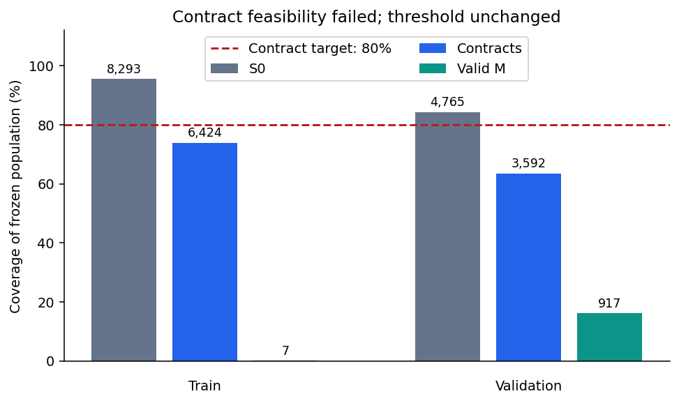
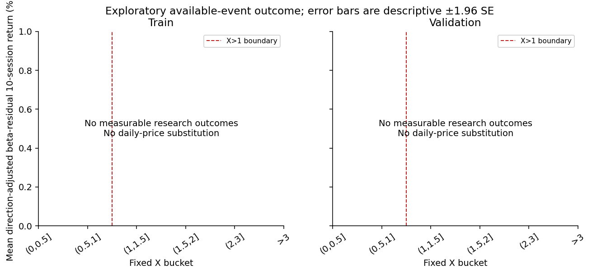
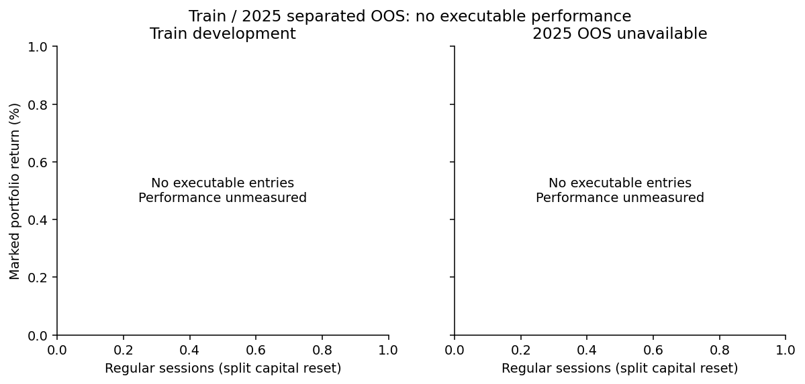

# Earnings moves beyond the option-implied range: a transparent feasibility study

**Submission status: failed preregistered feasibility threshold.** This submission reports that failure and a budget-bounded implementation demonstration. It does not claim a successful confirmatory strategy or change the 80% threshold.

## Economic hypothesis and frozen signal

An earnings price reaction larger than the historical ATM straddle-premium move proxy may indicate incomplete information incorporation and continuation in the residual reaction direction. The alternative is overreaction; option time value and risk premia confound a pure surprise interpretation. At the completed pre-event [15:50,15:55) ET window, S0 is the median valid underlying NBBO midpoint. Select the earliest standard 100-share expiry from D+7 through D+21 inclusive, nearest matching call/put strike, lower strike on a tie. At three or more shared valid completed minutes, M is the median of (call midpoint + put midpoint)/underlying midpoint. No contract substitutions repair a failure.

At D's completed [10:00,10:05) ET reaction window, r=S1/S0−1 on comparable split bases; a is the total-return reaction less the frozen clipped [0,2] beta times SPY's total-return reaction. Beta uses an intercept and the preceding 120 sessions, at least 100 paired returns; RV20 requires all preceding 20. X=abs(r)/M; finite nonzero sign-consistent r and a are required. Only X>1 trades in sign(a); X=1 does not qualify. No future price enters X.

## Full-universe feasibility and attrition

| Split | Population | Valid S0 | Selected pairs | Contract coverage / 80% target | Valid M | M / selected pairs |
|---|---:|---:|---:|---|---:|---:|
| train | 8,688 | 8,293 | 6,424 | 73.94% — failed | 7 | 0.11% |
| validation | 5,652 | 4,765 | 3,592 | 63.55% — failed | 917 | 25.53% |

The population is the frozen operational train/validation sample. Unresolved roots are exclusions; failed events are not backfilled. Timestamp/vendor vintage and reference-bracketing limitations remain unresolved. Contract feasibility is failed independently of subsequent returns.

## Primary separated 2025 OOS: unavailable performance

2025 was used for data-feasibility/coverage checks, with no recorded strategy-return inspection or return-based tuning of thresholds, sizing, costs or holding period. It is the primary separated OOS period, but the fixed benchmark has zero measurable signals/outcomes and zero trades: OOS performance is unavailable. Earlier development and post-freeze reports already processed these exclusions; no further 2025 outcome evaluation is performed. Full-universe OOS performance was not acquired.

## Available-event demonstration

The existing outcome-blind, chronological/liquidity-stratified 20-event NBBO benchmark is used only as an exploratory implementation demonstration. Its original selection was not a strategy sample. The request ceiling prevents full-universe post-event/reference/execution NBBO acquisition; this demonstration cannot establish full-population predictive performance. Every selected benchmark event is retained in the attrition log; invalid events are not replaced. Ten-session split-boundary crossings are purged by calendar, not returns.

| Split | Fixed events | Signal measurable | Research outcomes | X>1 | X≤1 |
|---|---:|---:|---:|---:|---:|
| train | 10 | 0 | 0 | 0 | 0 |
| validation | 10 | 0 | 0 | 0 | 0 |

Research outcomes use direction-adjusted stock-minus-beta-SPY total returns between median valid NBBO references in [10:10,10:20) ET on D and D+10 sessions. Both signal groups remain eligible irrespective of borrow, allocation or executable capacity. Missing reference observations remain unresolved; daily closes never substitute for these reference windows.

The frozen primary regression is Y_research ~ intercept + I(X>1) + abs(r) + RV20 with two-way issuer/date clustering. Small or absent threshold groups, rank deficiency and fewer than 30 clusters prevent a confirmatory claim; exact diagnostics are in summary.json. No thresholds, buckets, costs or model parameters were chosen from performance.

## Executable accounting and sensitivity

Initial allocation is 1% of $1 million reference equity per issuer, with a 50% stock gross allocation cap and proportional simultaneous-entry scaling. S1 known at signal completion determines intended whole-share quantities. Scheduled exits precede new entries; shares stay fixed except corporate actions. All security orders in a window share 1% observed window-volume capacity. Reference midpoint fills pay half the contemporaneous median spread plus 2 bps adversely, $0.001/share commission, modeled historical sell-side SEC/FINRA charges, and action cashflows. Doubled-cost sensitivity doubles modeled friction; conservative commissions are $0.005/share with $1/order minimum. Exchange/CAT fee pass-through remains unresolved; these are net-of-modeled-cost results, not net of every possible route fee. VWAP/midpoint execution benchmarks do not guarantee attainable fills. Missing historical borrow evidence excludes shorts and physical short-SPY hedges from executable returns, while retaining measurable research observations. No short-proceeds interest is assumed. Long stock allocations require no leverage under the capital convention.

| Split | Implementation | Entries | Annualized return | Annualized volatility | Sharpe (rf=0) | Max drawdown | Status |
|---|---|---:|---:|---:|---:|---:|---|
| train | directional | 0 | unmeasured | unmeasured | unmeasured | unmeasured | no_executable_entries |
| train | doubled_cost | 0 | unmeasured | unmeasured | unmeasured | unmeasured | no_executable_entries |
| train | conservative_commission | 0 | unmeasured | unmeasured | unmeasured | unmeasured | no_executable_entries |
| train | physical_hedge | 0 | unmeasured | unmeasured | unmeasured | unmeasured | no_executable_entries |
| validation | directional | 0 | unmeasured | unmeasured | unmeasured | unmeasured | no_executable_entries |
| validation | doubled_cost | 0 | unmeasured | unmeasured | unmeasured | unmeasured | no_executable_entries |
| validation | conservative_commission | 0 | unmeasured | unmeasured | unmeasured | unmeasured | no_executable_entries |
| validation | physical_hedge | 0 | unmeasured | unmeasured | unmeasured | unmeasured | no_executable_entries |

Annualized turnover is **0.000** for both train and 2025 OOS, under base and doubled costs. All four performance statistics remain unmeasured because no entries were executable. Doubled-cost sensitivity therefore provides no empirical cost-resilience evidence.

Annualization uses 252 sessions and daily action-aware close marking. Turnover, drift, orders, partial fills, missing marks and unresolved exposures are exported. Unresolved exits remain in the portfolio and invalidate complete executable performance rather than disappearing from the trade sample. No-entry plots and metrics are explicitly labeled, not evidence of profitability. The primary executable metric is mean net ten-session trade P&L per initial executed stock dollar; uncertainty is insufficient for small demonstration samples.

## Holdout and reproducibility

Full confirmatory 2026 acquisition was not completed under the fixed budget. The already-completed maximum-three pilot is exploratory only: two invalid S0 exclusions and one invalid synchronized M exclusion, zero outcomes and zero trades. It cannot replace the required confirmatory OOS. No more pilot work is performed.

The submission is sealed. Run `python run_all.py --offline` to render the frozen public result checkpoints into figures and the three-page PDF without API access or outcome reevaluation. Raw licensed data is excluded from the public repository; full independent raw-data reproduction requires the original local checkpoints and vendor entitlements. Original implementation-freeze and one-shot pilot records remain intact; submission_seal.json records final presentation changes and unchanged strategy-code hashes.

Sources: [approved specification](../../EXPERIMENT.md), [OPRA schema](https://databento.com/docs/venues-and-datasets/opra-pillar), [SEC historical fee change](https://www.sec.gov/rules-regulations/fee-rate-advisories/2025-2), [FINRA fee schedule](https://www.finra.org/sites/default/files/2024-11/sr-finra-2024-019.pdf), [NYSE calendar](https://www.nyse.com/publicdocs/nyse/ICE_NYSE_2026_Yearly_Trading_Calendar.pdf).
